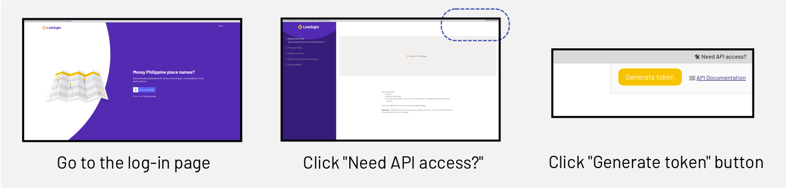

=====
Usage
=====

Generating your access token
----------------------------

Using the Python API requires an API token, which you can obtain from this
`link <https://linksight-stg.thinkingmachin.es/>`_. Simply log-in, go to the
*upper-rightmost* corner, click the "Need API Access?" button, then "Generate
token":

Basic usage
-----------

The LinkSight API client can be used like any other Python packages. To perform
matching, simply follow these steps:

- Create an instance of `linksight.Client` by supplying your API token
- Call `create_dataset` while providing the path to your dataset as a CSV file.
- Perform matching on the resulting dataset by providing the columns
    corresponding to the "Barangay", "Municipality", and "Province"

.. code-block:: python

   import linksight
   import pandas

   # Insert your API token here
   # In practice, you should not expose nor share your 
   # personal token to others
   API_TOKEN = <API_TOKEN> 

   # Create an instance of the Client
   ls = linksight.Client(<API_TOKEN>)

   # Provide your dataset to the API
   with open('path/to/my/dataset.csv') as fp:
       ds = ls.create_dataset(open('some.csv'))

   # Perform matching by specifying the column names
   # for the respective admin level
   match = ds.match(
       source_bgy_col='Barangay',
       source_municity_col='City',
       source_prov_col='Province',
   )

   # Transform the matched dataset to a pandas DataFrame
   df = pd.read_csv(match['matched_dataset']['file'])
